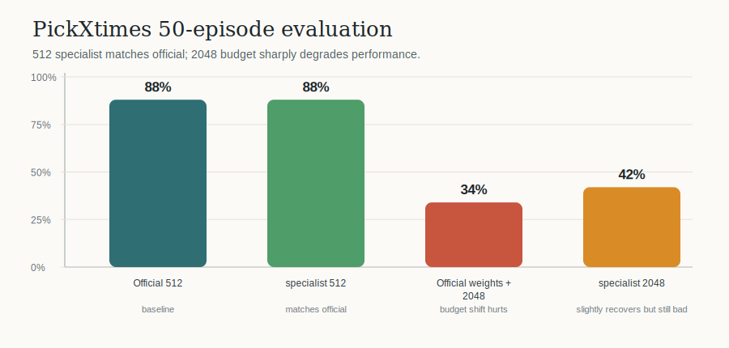

# RoboMME PickXtimes NSCC Study

This folder summarizes the effective PickXtimes-only RoboMME experiments run on NSCC after fixing the normalization-stat alignment issue.

## Main Result

| Run | Budget | Train | Eval | Result |
|---|---:|---|---|---:|
| Official MME-VLA checkpoint | 512 | none | 50 episodes | 44/50 = 0.88 |
| PickXtimes specialist | 512 | 500 steps, `mem_action` | 50 episodes | 44/50 = 0.88 |
| Official weights with longer memory | 2048 | none | 50 episodes | 17/50 = 0.34 |
| PickXtimes specialist | 2048 | 500 steps, `mem_action` | 50 episodes | 21/50 = 0.42 |

## Conclusion

The corrected 512-budget specialist matches the official checkpoint. The previous 41/50 drop was therefore caused by setup mismatch, primarily old normalization stats inside the specialist checkpoint assets.

Increasing frame-sampling budget from 512 to 2048 is not beneficial in this setup. It changes the memory-token distribution and sharply hurts performance even without training: official weights drop from 44/50 to 17/50. A short 2048 specialist train recovers only slightly to 21/50.

Recommended next step: keep the official 512-budget history path for PickXtimes, then analyze the six remaining failure episodes or try smarter history selection/token dropping instead of increasing raw budget.

## Effective Training Setup

| Item | Value |
|---|---|
| Upstream policy repo | `RoboMME/robomme_policy_learning` |
| Policy commit | `ecf086c3be7c2223167d9bb2f6ef1f0a6e24353b` |
| Benchmark commit | `56b7377c5dae50af21b9627871ae8cfcab0fa8dd` |
| Base checkpoint | official `perceptual-framesamp-modul/79999` |
| Task data | PickXtimes episodes 500-599, 100 episodes, 53,720 samples |
| Trainable subset | parameters matching `mem|action|time`, about 86.4 MB |
| 512 train | batch size 8, 500 steps, lr 5e-5 |
| 2048 train | batch size 2, 500 steps, lr 5e-5 |
| Eval protocol | first 50 PickXtimes episodes, `max_steps=1300`, seed 42 save path |

## W&B

The W&B project used for live tracking is [starVLA_RoboMME_NSCC](https://wandb.ai/laockets-nus/starVLA_RoboMME_NSCC). If that organization page is not externally accessible, the plots and TSV files in this folder are the offline shareable record.

| Run | Link |
|---|---|
| 512 specialist | https://wandb.ai/laockets-nus/starVLA_RoboMME_NSCC/runs/pdblyyk2 |
| 2048 specialist | https://wandb.ai/laockets-nus/starVLA_RoboMME_NSCC/runs/biqlgr2u |

## Files

| Path | Purpose |
|---|---|
| `results/pickxtimes_results.tsv` | Final compact result table |
| `results/pickxtimes_episode_outcomes.tsv` | Per-episode success/failure for all four runs |
| `results/train_metrics.tsv` | Parsed training loss/gradient snapshots |
| `figures/*.svg` | Offline figures for sharing without W&B access |
| `configs/` | Official 512 config and tested 2048 config |
| `scripts/` and `pbs/` | NSCC launch scripts used for effective runs |
| `patches/robomme_policy_learning_effective_changes.patch` | Effective code changes relative to upstream |
| `logs/` | Redacted raw train logs for the two specialist runs |

No API keys, private keys, datasets, checkpoints, or NSCC login secrets are included.
